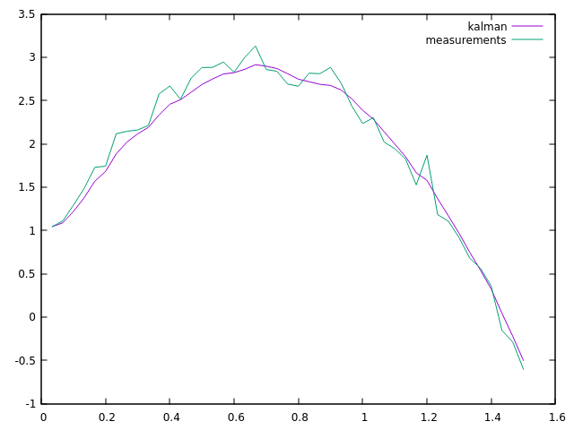

Kalman Filter
=============
This is a basic Kalman filter implementation in C++ using the
[Eigen](http://eigen.tuxfamily.org/) library. It implements the algorithm
directly as found in [An Introduction to the Kalman Filter]
(http://www.cs.unc.edu/~welch/media/pdf/kalman_intro.pdf).

It also generates an animated plot to view the progression of the kalman filter in
gnuplot.

There is a test program that estimates the motion of a projectile based on
noisy observations. To run it, use CMake:

    cd kalman-cpp
    mkdir build
    cd build
    cmake ..
    make
    ./kalman-test

Note: You may have to specify the path to your Eigen library in
`CMakeLists.txt`.

Dependencies
============
```
libgnuplot-iostream-dev
libeigen3-dev
```

Kalman Test results
===================

